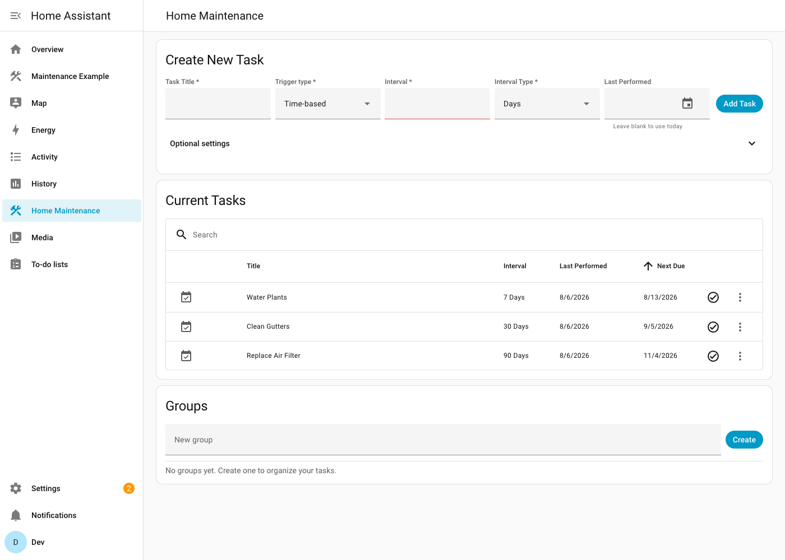
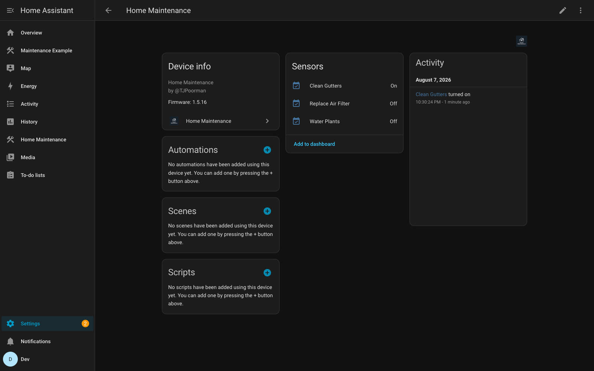
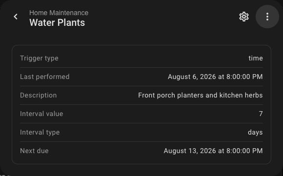

# Home Maintenance Tracker for Home Assistant

A custom Home Assistant integration for tracking recurring home maintenance tasks — changing air filters, cleaning gutters, testing smoke alarms — directly inside Home Assistant. Each task gets its own entity that turns on when the task is due, a built-in sidebar panel (with task groups) manages everything, a bundled Lovelace card surfaces due tasks on any dashboard, and tasks can recur on a schedule, after a number of uses, or once a monitored sensor accumulates enough runtime.

Originally created by [@TJPoorman](https://github.com/TJPoorman/home_maintenance); this fork adds count- and runtime-based triggers, area support, task groups, task descriptions, a dashboard card, Home Assistant 2026.3 compatibility, and automated releases — incorporating contributions from [@Seidlm](https://github.com/Seidlm), [@select-star-from](https://github.com/select-star-from), and [@csteamengine](https://github.com/csteamengine).

[](https://github.com/kedube/ha-home_maintenance/actions/workflows/ci.yml)
[](https://hacs.xyz/)

## Contents

- [Installation](#installation)
- [Configuration](#configuration)
  - [Options](#options)
- [Using the Panel](#using-the-panel)
  - [Trigger types](#trigger-types)
  - [Optional task fields](#optional-task-fields)
  - [Task groups](#task-groups)
  - [NFC tags](#nfc-tags)
- [Dashboard card](#dashboard-card)
- [Entities](#entities)
- [Services](#services)
- [Automation ideas](#automation-ideas)
- [Screenshots](#screenshots)
- [Project scope](#project-scope)
- [Development](#development)
- [Need help?](#need-help)
- [License](#license)

## Installation

> Requires Home Assistant **2026.3.2** or newer.

### Method 1: HACS custom repository

1. In Home Assistant, open **HACS**.
2. Open the menu in the top-right corner (**⋮**) and select **Custom repositories**.
3. Paste this repository's URL: `https://github.com/kedube/ha-home_maintenance`
4. Set the category to **Integration** and click **Add**.
5. Search for **Home Maintenance** in HACS, open it, and click **Download**.
6. Restart Home Assistant.

After restart, add the integration from Home Assistant:

[](https://my.home-assistant.io/redirect/config_flow_start/?domain=home_maintenance)

### Method 2: Manual installation

1. Download `home_maintenance.zip` from the [latest release](https://github.com/kedube/ha-home_maintenance/releases) and extract it into `config/custom_components/home_maintenance`.
2. Restart Home Assistant.
3. Add the integration from **Settings → Devices & Services → Add Integration**, searching for **Home Maintenance** — or use the badge above.

Once added, the **Home Maintenance** panel appears in the sidebar.

## Configuration

Setup asks for two options; both can be changed later without removing the integration:

- **Admin only** — restrict the sidebar panel to admin users (default: **on**). Non-admin users don't see the panel, but task entities remain visible to everyone.
- **Sidebar title** — the name shown for the panel in the sidebar (default: *Home Maintenance*).

Only a **single instance** of the integration can be added — all tasks live under that one entry.

### Options

To change these settings after setup:

1. Go to **Settings → Devices & Services**.
2. On the **Integrations** tab, find the **Home Maintenance** card (or click the badge below to jump straight there).
3. Click **Configure** on the Home Maintenance entry, adjust the options, and click **Submit**.

[](https://my.home-assistant.io/redirect/integration/?domain=home_maintenance)

Submitting reloads the integration automatically, so changes — including a new sidebar title — take effect without restarting Home Assistant.

> 💡 **Configure vs. Add.** Use **Configure** (the button on the *existing* entry) to change these options. The **Add integration** flow is only for the initial setup — a second entry can't be added.

## Using the Panel

Open **Home Maintenance** from the sidebar. The **Add New Task** card creates tasks; the task table shows every task with its interval, last-performed date, and next due date, and marks tasks that are due or overdue. Each row has a ✓ button to mark the task complete (after a confirmation, since completing resets the schedule or counter) and a menu for editing (including the title), moving the task to a [group](#task-groups), or deleting it.

The panel updates live: changes made outside it — an NFC tag scan, a service call, an automation incrementing a counter, a runtime sensor ticking over — appear immediately without a refresh.

### Trigger types

Every task has a trigger type that controls when it becomes due:

| Trigger | Due when… | Completing the task… |
| --- | --- | --- |
| **Time-based** (default) | the interval (days, weeks, or months) since the last-performed date has elapsed | resets the last-performed date |
| **Count-based** | a monitored entity has turned on a threshold number of times | resets the counter to zero |
| **Runtime-based** | a numeric sensor has accumulated a threshold amount since the last completion (e.g. hours of runtime, liters of consumption) | records the sensor's current value as the new baseline |

- **Count-based** tasks watch an entity you pick and count each `off → on` transition — e.g. "descale the coffee machine every 60 brews" counting a power switch. The panel shows progress as `current / threshold`. The counter can also be adjusted by [service call](#services).
- **Runtime-based** tasks watch a numeric sensor and compare its growth against a threshold — e.g. "service the generator every 50 running hours" using a runtime counter sensor. If the source sensor is reset externally (its value drops below the recorded baseline), the baseline resets automatically so progress keeps making sense.

### Optional task fields

- **Last performed** — defaults to today when omitted.
- **Icon** — any Material Design icon (default `mdi:calendar-check`).
- **Labels** — Home Assistant labels applied to the task's entity.
- **NFC tag** — scanning the tag marks the task complete (see [NFC tags](#nfc-tags)).
- **Area** — assigns the task's entity to a Home Assistant area.
- **Description** — free-form notes, shown as an entity attribute.
- **Group** — organizes the task into a named [group](#task-groups); pick an existing group or type a new name to create one on the fly.

### Task groups

Tasks can be organized into named groups — *Kitchen*, *HVAC*, *Outdoors* — and the task table renders one section per group (with ungrouped tasks first). Groups are managed three ways:

- The **Groups** card in the panel creates, renames, and deletes groups. Renaming a group moves all its tasks along; deleting a group moves its tasks back to *Ungrouped* (the tasks themselves are never deleted).
- The **Group** field in the add/edit forms assigns a task to a group — typing a new name there creates the group implicitly.
- **Move to group** in a task's row menu quickly reassigns a single task.

### NFC tags

Assign an NFC tag to a task and scanning that tag marks the task complete. Assign the same tag to several tasks to complete them all with one scan — handy for a "furnace room" tag that resets every filter task at once.

## Dashboard card

The integration bundles a **Home Maintenance Todo** Lovelace card that mirrors the panel on any dashboard: tasks bucketed into **Overdue**, **Due soon**, and **Upcoming**, with a search box, a group filter, quick complete/remove actions, and expandable details (description, last performed, count/runtime progress). The card is registered automatically — no manual resource setup — and appears in the card picker once the integration is loaded, or add it via YAML:

```yaml
type: custom:home-maintenance-todo-card
title: Home Maintenance      # optional header (omit for none)
due_soon_days: 14            # window for the "Due soon" bucket
max_items: 0                 # cap the list (0 = no limit)
show_search: true            # search box + group filter
```

The card updates live over the same push channel as the panel, and its header links back to the full panel for editing. Set `group: Kitchen` to pin a card to a single [task group](#task-groups) (this hides the group dropdown) — handy for one card per room or system.

An **Add Task** card is bundled too — the panel's full add-task form (trigger types, groups, and all optional fields) on any dashboard, so tasks can be created without opening the panel:

```yaml
type: custom:home-maintenance-add-task-card
title: Add Maintenance Task   # optional header (empty for none)
```

For a complete view combining the cards with templated summaries and core cards, see the [example dashboard](docs/example-dashboard.md).

## Entities

Each task is a `binary_sensor` (grouped under one *Home Maintenance* device) that is **on** while the task is due. Attributes depend on the trigger type:

| Attribute | Time | Count | Runtime |
| --- | :-: | :-: | :-: |
| `trigger_type`, `last_performed`, `description` | ✓ | ✓ | ✓ |
| `tag_id` (when an NFC tag is assigned) | ✓ | ✓ | ✓ |
| `interval_value`, `interval_type`, `next_due` | ✓ | | |
| `current_count`, `count_threshold`, `count_entity_id` | | ✓ | |
| `runtime_entity_id`, `runtime_threshold`, `runtime_baseline`, `runtime_current`, `runtime_delta` | | | ✓ |

## Services

### `home_maintenance.reset_last_performed`

Marks a task as completed and updates its `last_performed` and `next_due`. Optionally back-date the completion with `performed_date`.

```yaml
action: home_maintenance.reset_last_performed
data:
  entity_id: binary_sensor.clean_gutters
  performed_date: "2026-06-19"  # optional; defaults to today
```

### `home_maintenance.increment_count`

Increments the usage counter of a count-based task — useful when the usage you want to count isn't a single entity turning on.

```yaml
action: home_maintenance.increment_count
data:
  entity_id: binary_sensor.descale_coffee_machine
```

### `home_maintenance.reset_count`

Resets a count-based task's counter to zero **without** marking the task complete.

```yaml
action: home_maintenance.reset_count
data:
  entity_id: binary_sensor.descale_coffee_machine
```

## Automation ideas

**Get notified when a task becomes due.** Every task is a binary sensor, so a state trigger is all it takes:

```yaml
automation:
  - alias: "Maintenance: HVAC filter due"
    triggers:
      - trigger: state
        entity_id: binary_sensor.change_hvac_filter
        to: "on"
    actions:
      - action: notify.mobile_app_your_phone
        data:
          title: "Home maintenance due"
          message: "Time to change the HVAC filter."
```

**A weekly digest of everything due.** Group your task entities with a template that lists the ones currently on, and send it on Saturday morning.

**Count usage that isn't an on/off entity.** Call `home_maintenance.increment_count` from any automation — for example, increment a "clean the grill" task each time a temperature sensor shows the grill was used.

## Screenshots





## Project scope

This integration fills a simple gap: recurring tasks without stacks of helpers and automations. It is intentionally minimal — focused on task tracking. Home Assistant already provides powerful dashboards, automations, and alerts; this integration complements them rather than replacing them, so feature requests that duplicate native functionality may be declined.

## Development

The repo ships a devcontainer (Python 3.14, Node 20) and helper scripts:

- `scripts/setup` — create a `.venv` and install requirements.
- `scripts/develop` — run a local Home Assistant instance with the integration symlinked in.
- `scripts/lint` — run ruff over the codebase (CI enforces `ruff check` and `ruff format --check`).

Run the test suite (coverage gate: 85%) with:

```sh
pip install -r requirements_test.txt
python -m pytest
```

The sidebar panel is a Lit + TypeScript app in `custom_components/home_maintenance/panel/` (dependencies are exact-pinned via the committed `package-lock.json`). After changing panel sources, rebuild the committed bundle:

```sh
cd custom_components/home_maintenance/panel
npm ci
npm run build   # regenerates dist/main.js
```

For a tour of how the pieces fit together — the task store, dispatcher signals, trigger strategies, push entities, the websocket API, and the panel components — see [docs/architecture.md](docs/architecture.md).

### CI and releases

Every push and pull request runs the **CI** workflow: HACS validation, hassfest, ruff, pytest on Python 3.13 and 3.14 (with an 85% coverage gate), and a panel type-check + build that fails if the committed `dist/main.js` drifts from the sources. A weekly, non-blocking **HA next** job additionally runs the suite against the newest Home Assistant pre-release as an early warning for upstream breaking changes, and dependabot keeps the panel's npm dependencies fresh (its PRs get the bundle rebuilt automatically). When CI passes on `main`, the **Release** workflow automatically bumps the patch version (in `const.py` and `manifest.json` together), rotates the `Unreleased` section of [CHANGELOG.md](CHANGELOG.md) into the release notes, tags `vX.Y.Z`, and publishes a GitHub release with the HACS zip attached. Minor/major bumps (or a re-release) can be triggered manually from the workflow's **Run workflow** menu.

When contributing, add a line describing your change under `## Unreleased` in [CHANGELOG.md](CHANGELOG.md) — it becomes the *Highlights* section of the next release's notes. See [CONTRIBUTING.md](CONTRIBUTING.md) for the full guidelines.

## Need help?

Open an [issue](https://github.com/kedube/ha-home_maintenance/issues) here on GitHub, or ask in the [Home Assistant community thread](https://community.home-assistant.io/t/new-integration-home-maintenance-track-recurring-tasks-in-home-assistant/897324) for the upstream project.

## License

[MIT](LICENSE) — free to use, share, and improve.
